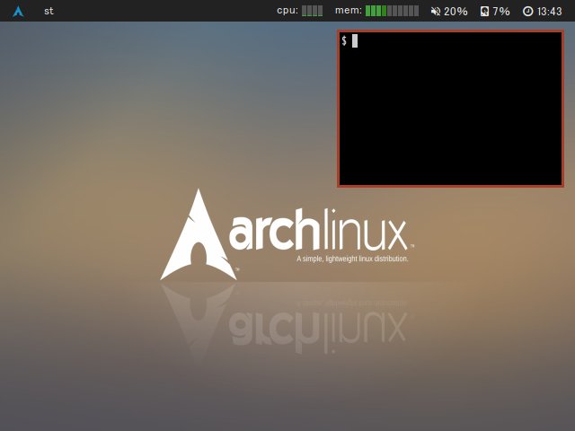

# bspwmbar


A lightweight status bar for bspwm.

Currently required [nerd-fonts](https://github.com/ryanoasis/nerd-fonts)
(Arch: [ttf-nerd-fonts-symbols](https://www.archlinux.jp/packages/community/x86_64/ttf-nerd-fonts-symbols/))



## Features and TODO

- [x] Support multiple monitors (Xrandr)
- [x] Render text
- [x] Bspwm desktops
- [x] Active window title
- [x] Datetime
- [x] CPU temperature
- [x] Disk usage
- [x] ALSA volume
- [x] Memory usage
- [x] CPU usage per core
- [x] Battery support
- [x] Backlight support
- [x] Implements clickable label
- [x] System Tray support
- [x] Refactor code
- [x] Emoji support (with color)
- [x] Ligature support
- [x] OpenBSD support
- [ ] FreeBSD support
- [ ] Pulseaudio support (The priority is low because pulseaudio has alsa interface)

## Configure

Modify and recompile `config.h` like `dwm`, `st`.

## Install

You can install from [AUR](https://aur.archlinux.org/packages/bspwmbar/) on Arch Linux.

Or build and install by using `make` and `make install`.

## Build & Debug

```sh
./configure
make

# debug build with AddressSanitizer
make debug

# static analyze with clang
scan-build make debug
```
